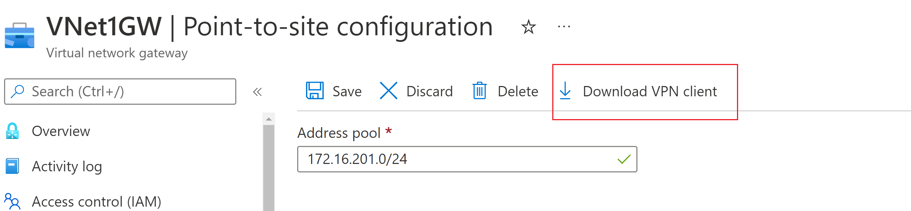
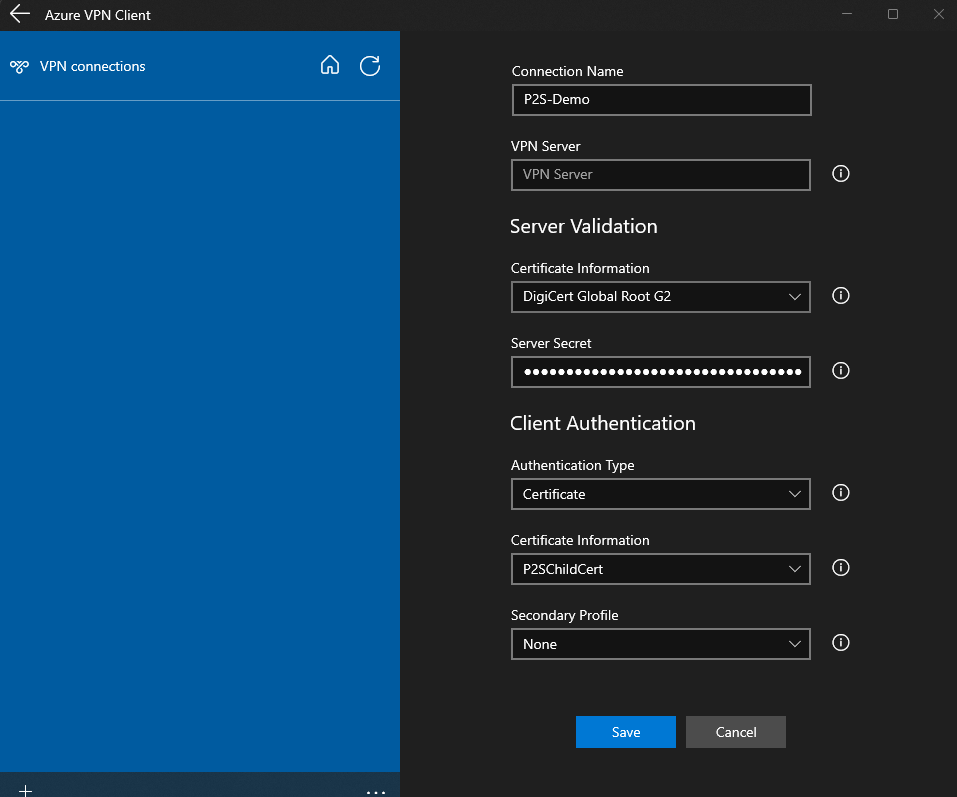

# Module: Hub and spoke network
This module was developed to simplify the creation of a hub-and-spoke network in Azure with a P2S VPN.

Two separate spoke networks to demonstrate separation of workloads. The networks share common resources using hub virtual network. Spokes can be used to isolate workloads in their own VNets, managed separately from other spokes. Each workload might include multiple tiers, with multiple subnets.

This demo environment does not use an Azure Bastion or similar, but a Point-to-Site (P2S) VPN connection. P2S VPN is also a useful solution to use instead of S2S VPN when you have only a few clients that need to connect to a VNet. It is essential that the required certificates are provided before deploying.


## Requirements
To use this module, an <b>Azure Key Vault</b> and a <b>certificate for the P2S VPN connection</b> are required. If both resources are not available or created before the deployment, the deployment will result in an error.

<b>Note:</b> To create these resources, please switch to the [previous section](/README.md) under <b> Create an Azure Key Vault</b> and <b>Certificate for P2S VPN connection</b>.

## Terraform CLI
<b>`NOTE:`</b> Please skip the next steps and go directly to <b>verify the results</b> if you have executed the terraform from the [main.tf](/main.tf).

### Initialize Terraform
Run <b>terraform init</b> to initialize a working directory that contains a Terraform configuration. This command downloads the Azure provider required to manage the Azure resources. The <b>-upgrade</b> parameter upgrades the necassary provider plugins to the newest version that complies with the configurations version constraints.
```
terraform init -upgrade
```

### Create a Terraform execution plan
Run <b>terraform plan</b> to create an execution plan. 
```
terraform plan
```

### Apply a Terraform execution plan
Run <b>terraform apply</b> to apply the execution plan.
```
terraform apply
```

## Verify the results
Log in to the [Azure portal](https://portal.azure.com) navigate to the newly created <b>Virtual Network Gateway</b> and download the <b>VPN client</b> under the <b>Point-to-site configuration</b>.




## Import the configuration and connect to Azure
Open the Azure VPN client on your workstation and import the <b>azurevpnconfig.xml</b> from the file you just donwloaded. 



Under <b>Client authentication</b>, change the certificate information in the previously created certificate file, e.g. <b>P2SChildCert</b>, and save the configuration. After saving, locate the VPN connection and click <b>Connect</b>.